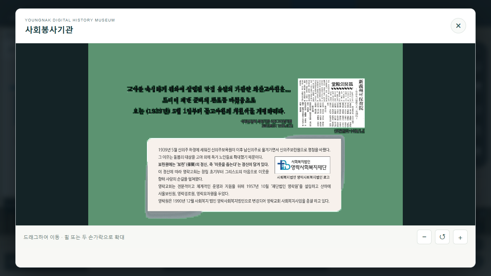
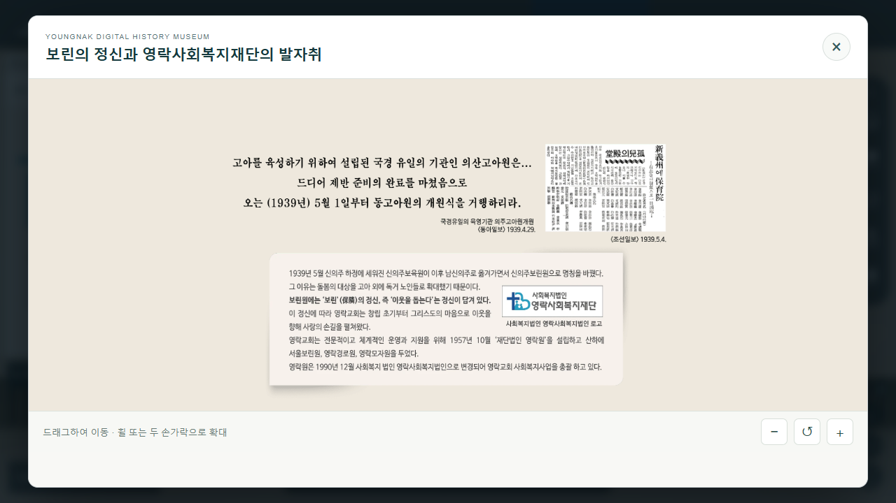

# 전시 확대·제목 검증

## 변경 내용

확대 창의 OpenSeadragon WebGL 기본 렌더러를 Canvas로 전환했다. 투명 영역의 숨겨진 RGB가 초록 배경으로 드러나고 글자·그림자가 검게 겹치던 합성 오류를 수정했다. 원본 이미지, 피라미드, 드래그·핀치와 확대 범위는 유지한다.

직접 이미지 확대는 기본 아이보리 `#EEE8DD`다. 투명 영역에 밝은 글씨가 있는 자료는 어두운 바탕을 사용한다. 흰 연도와 검은 본문이 함께 있는 자료에는 `#7A766D`를 적용해 두 색이 모두 읽히도록 한다. 최종 전시판 배경은 아이보리 101개, 어두운 바탕 98개, 혼합 글자용 중간 바탕 8개다. 원본 이미지를 다시 그리거나 수정하지 않는다. 사진 갤러리의 배경과 3D·360도 뷰어는 기존 그대로다.

[제목 목록](../src/data/content-titles.json)은 전시판 207개, 로비 4종의 PNG·확대 JPG 8개, 본문 224개, 사진·도움말 갤러리 603개를 포함한다. 실제 전시판·연결 본문·원본 캡션을 대조했고 근거를 각 항목에 기록했다. 전시판 제목 154개, 본문 제목 213개, 갤러리 제목 109개를 교정했으며 정확한 나머지 제목은 유지했다.

`title-resolver.ts`가 패널 클릭, 크게 보기, 페이지 목록, 접근성 설명, 사진·본문 제목과 공유 링크의 표시 제목을 결정한다. 예전 주소에 `사회봉사기관+·+사회봉사기관`이 있어도 알려진 이미지의 교정 제목으로 바꾼다. URL의 공백은 표준 방식으로 읽고, 원사이트의 raw `+` 호환 처리는 공간 ID에만 적용한다.

## 검증 근거

- Node 테스트 72개, TypeScript 검사 및 미리보기 운영 빌드 통과.
- 전시판 207개를 실제 확대 뷰어로 순서대로 열어 제목·ARIA·Canvas·피라미드·로딩·정리를 검사했다. 본문 224개 응답과 로비 이미지 8개도 확인했다.
- A03·B03·C02·D02·로비 C 자료를 전체 보기/2배/4배로 캡처했다. 원본을 직접 그린 Canvas와 비교해 투명 영역 내부에 불필요한 색이 표시되는 표본은 0개였다. 축소 피라미드와 보간에 따른 가장자리 차이는 있어 픽셀 전체가 완전히 일치한다고 주장하지 않는다.
- 실제 VR 패널 클릭과 ‘크게 보기’, 페이지 선택, 오래된 raw-plus 링크가 같은 교정 제목과 공유 주소를 표시한다. 확대 후 드래그·전체 보기 복귀를 확인했다.
- 모바일 390×844 Chrome 에뮬레이션에서 제목·툴바, 버튼, 실제 터치 이벤트를 통한 핀치·드래그·닫기를 확인했다. 물리적 휴대전화 검증은 아니다.
- 큰 사진 A06:43의 실제 WebP(3420×3840)가 정상 로드·확대된다. 20회 교대 열기·닫기 후 남은 Canvas/OSD/뷰어 참조는 0개, 안정화 후 JS 힙 증가량은 약 0.41MB, 이벤트 리스너 수는 동일했다.
- 독립 코드 검토에서 공통 제목 경로, URL, Canvas 수명과 원본 갤러리 복원 처리에 추가 결함이 발견되지 않았다.

상세 데이터: [PC 검사](content-review/desktop-content-audit.json), [모바일 검사](content-review/mobile-zoom-title-report.json), [A 검토](content-review/a-review-report.json), [B·D 검토](content-review/bd-review-report.json), [C·공통 검토](content-review/c-common-review-notes.md). 최종 캡처 검토에서 추가 확인한 배경 예외 9건은 [재검토 근거](content-review/matte-refinement.json)와 [실제 브라우저 재검사](content-review/final-matte-audit.json)에 기록했다. 이 기록이 초기 검토의 배경 분류보다 우선한다.

## 화면 비교

| 수정 전 | 수정 후 |
|---|---|
|  |  |

[C02 2배 확대](content-review/screenshots/after-c02-2x.png) · [흰 글자 자료](content-review/screenshots/after-a03-white-text.png) · [모바일](content-review/screenshots/after-mobile.png)

전체 확대 단계의 캡처와 원본 QA 로그는 `E:/CodexAssets/youngnak-visitor-qa/`에 보관했다.

## 별도로 확인한 원본의 불일치

이번 배포는 이미지 표시와 제목 수정으로 제한했다. 아래 원본 링크는 기존 상태를 보존하고 별도 기록했다.

- A07 20쪽: 신앙포털·말씀산책 이미지가 다음 쪽의 사회복지재단 본문 `a07_08`에 연결된다.
- C01 6·7쪽: 숭실과 보성의 전시판에 연결된 본문·사진 핫스폿이 서로 뒤바뀌어 있다. 표시 제목은 실제 이미지에 맞췄다.
- C05 6쪽: 루카이어 성경 패널이 교회 개척 원칙 본문 `c04_01`에 연결된다.

날짜가 서로 충돌하는 사진은 추정 연도를 추가하지 않고 검증 가능한 주제로 제목을 정했다. 확인된 원본 공백과 기존 대체 사진·관련 자료 안내는 유지한다.

## 배포 분리

공개본은 복원 기준 커밋 `14b0309`에 이미지·제목 수정만 적용한다. 이동 기능을 가진 미리보기는 `feat/3d-navigation-assist` 브랜치와 `http://127.0.0.1:4176/`에 유지한다. `full-museum.json`, 원본 미디어, `deployment-assets.json`은 변경하지 않는다.

## 공개 반영 결과

2026-10-05 기존 [공개 주소](https://youngnak-museum-poc.vercel.app/)에 반영했다. [GitHub main](https://github.com/postsun17-web/80history/commit/8b684752faf7c7ca784cc0dfa0e569ec60c0cabe)은 이미지·제목 수정만 포함하고, 미리보기의 이동 기능은 합치지 않았다.

- 구현 커밋: 공개본 `8b68475`, 이동 미리보기 `815ec73`.
- 배포: `dpl_CHBZ72SuYCpNEy1ttqTZvuYEnVrX`, 운영 JS `/assets/index-ChbOgBP3.js`.
- Vercel에서 원본 자산 8,130개의 복원·해시 검증 및 운영 빌드 통과.
- 공개용 브랜치의 테스트 54개·TypeScript·운영 빌드 통과. 미리보기의 72개와 차이는 미리보기 전용 이동 기능 테스트 18개다.
- 공개 주소에서 전시판 207개·본문 224개·로비 8개, 총 439개 자산의 HTTP 응답과 콘텐츠 형식 검증 통과.
- 공개 주소의 C02에서 교정 제목, 오래된 공유 링크, Canvas 2D, 아이보리와 투명 픽셀, 확대·복귀·닫기를 확인했다. A07 혼합 글자와 D02 흰 글자 자료 및 본문 제목도 확인했다.
- 지도 51개 지점·원본 62개 공간을 유지하며 미리보기의 ‘이전 위치’·지도 바로가기·이동 이름표가 공개본에 없음을 확인했다.

[공개 검증 데이터](content-review/production-check.json) · [공개 PC 화면](content-review/screenshots/after-production-desktop.png) · [모바일 수정 전](content-review/screenshots/before-mobile-c02.png) · [모바일 수정 후](content-review/screenshots/after-mobile-c02.png)
